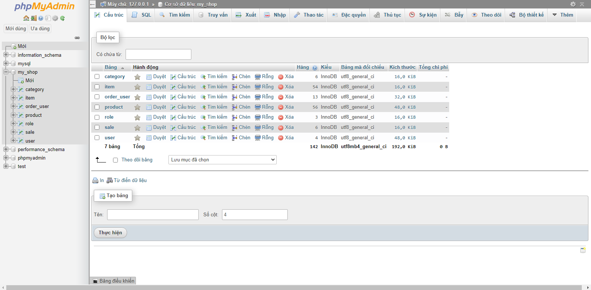
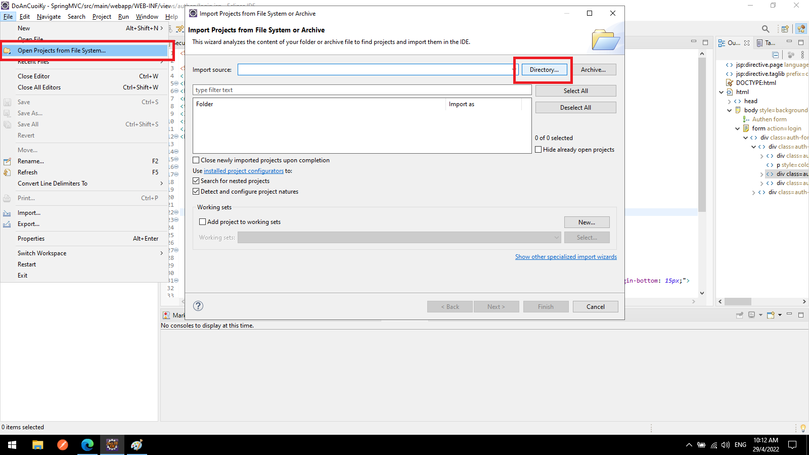
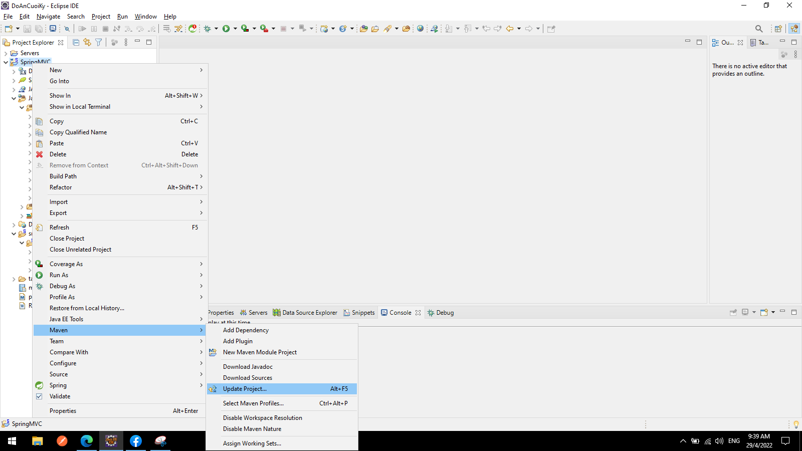
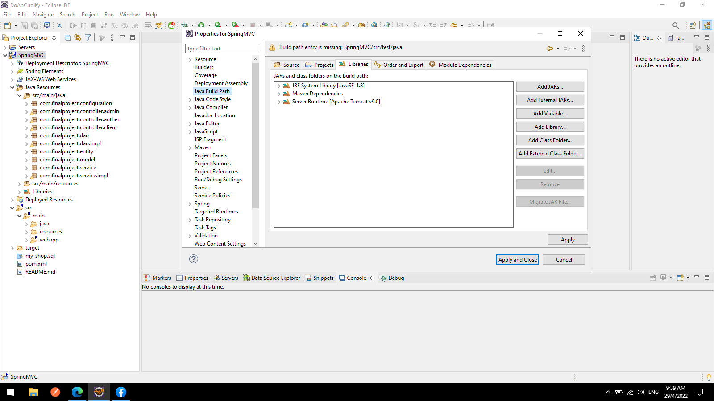
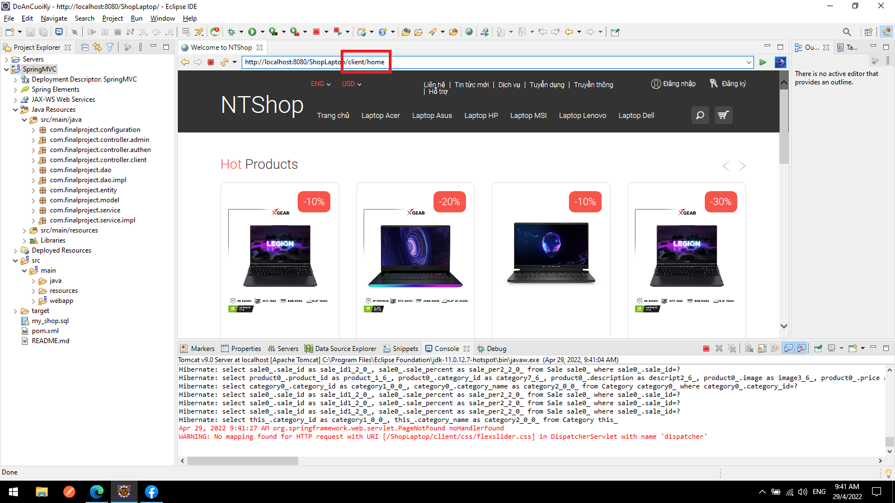

# Cách sử dụng Code Đồ án cuối kỳ môn Java WEB

<h2>Cài đặt MySQL</h2>
<h3>Tải my_shop.sql về máy, sử dụng XAMPP để kết nối cơ sở dữ liệu và nhập dữ liệu my_shop.sql vào server</h3>

<h2>Thêm Project và chọn đúng thư mục đã giải nén</h2>

<h2>Cập nhật Maven</h2>

<h2>Cập nhật JavaBuildPath để tương thích với phiên bản hiện tại của máy</h2>

<h2>Khi chạy thêm đường link: /client/home để chạy vào chương trình</h2>

<h2>Tài khoản Admin: admin@gmail.com----Mk: 123</h2>
